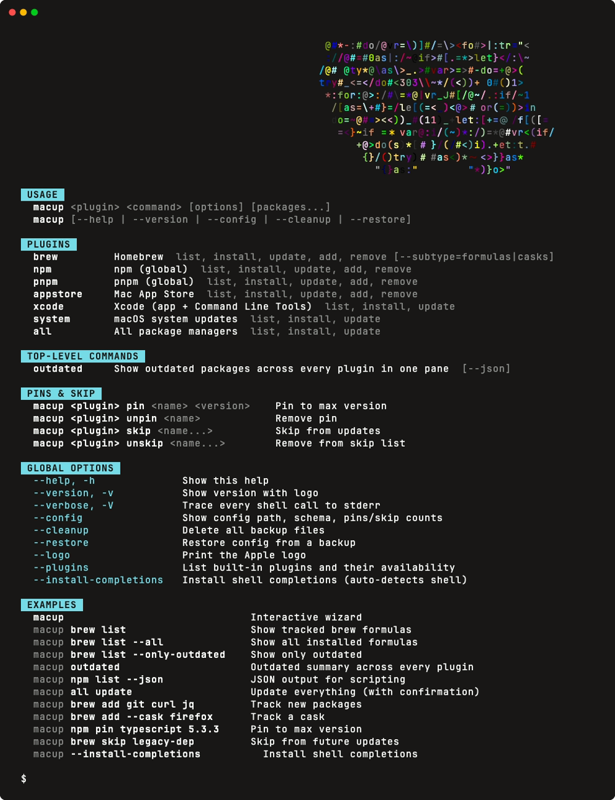

# macup

A plugin-based CLI for tracking and updating developer packages on macOS. Manages Homebrew formulas and casks, npm globals, Mac App Store apps, Xcode, and system updates, with version pins, skip lists, and an interactive wizard.

See [docs/README.md](docs/README.md) for the full documentation index.

<p align="center">
  
  <br>
  
  <br>
  
</p>

## Install

```bash
# via npm/pnpm (requires Node >= 20)
pnpm add -g macup
# or
npx macup

# via bun
bun add -g macup
```

## Quick start

```bash
# Interactive wizard (pick plugin, command, packages)
macup

# List all outdated brew formulas
macup brew list --only-outdated

# Update everything (all plugins, with confirmation)
macup all update

# Preview without running anything (install + update)
macup brew update --dry-run
macup brew install --dry-run

# Track packages in your applist
macup brew track git curl jq
macup brew track --cask firefox visual-studio-code
macup npm track typescript nodemon

# Pin a package to a max version
macup npm pin typescript 5.3.3

# Skip a package from future updates
macup brew skip legacy-dep

# Show config status
macup config

# List built-in plugins and whether each is available on your machine
macup plugins

# Restore from a backup
macup restore
```

These are commands, not flags: `macup restore`, never `macup --restore`. A flag modifies a command (`--json`, `--dry-run`, `--verbose`), so it is never the command itself. The one exception is `macup version`, which is rewritten to `--version` at argv parse time, because `--version` is the spelling every CLI has.

## Verbosity

Three modes:

- **default**: install/upgrade flows stream their subprocess output (downloads, `Password:` prompts, success messages) as lines in the same gutter as the rest of the UI: one design language, no separate pane (ADR 0034). Queries (list, outdated, health) show a clack inline spinner while they run. List/outdated commands keep their formatted output; their internal `--json` chatter stays hidden, except `Error:` / `Warning:` lines, which surface as one-line notices.
- **`--verbose` / `-V`**: the same, retained as the seam for future extra detail.
- **`--debug` / `-D`**: full raw trace of every shell call (`$ cmd args  exit=N · Nms` + line-buffered live stdout/stderr), routed to stderr, so you see the same thing you would see if you ran each underlying command yourself, plus timing.

Activity feedback is a single append-only path, so it renders identically on every terminal, under a pipe, and in CI. There is no capability probe or escape hatch to tune.

## Plugins

macup ships with 7 built-in plugins:

| Plugin | What it manages | Key commands |
| --- | --- | --- |
| `brew` | Homebrew formulas + casks | `list`, `install`, `update`, `add`, `remove` (use `--cask` for casks) |
| `npm` | Global npm packages | `list`, `install`, `update`, `add`, `remove` |
| `pnpm` | Global pnpm packages | `list`, `install`, `update`, `add`, `remove` |
| `appstore` | Mac App Store apps (via `mas`) | `list`, `install`, `update`, `add`, `remove` |
| `xcode` | Xcode.app + Command Line Tools | `list`, `install`, `update` |
| `system` | macOS system updates (`softwareupdate`) | `list`, `install`, `update` |
| `all` | Composite, fans across all plugins | `list`, `install`, `update` (partial-failure isolated) |

A top-level `macup outdated` shows outdated packages across every available plugin in one pane (add `--json` for machine-readable output).

Every plugin also supports `pin`, `unpin`, `skip`, `unskip` for packages tracked in your config.

`<plugin> update` upgrades only tracked, outdated packages by default, the same scope as `install` and `list`. Pass `--all` to upgrade every outdated package, tracked or not. The composite `all update` stays system-wide. Both `install` and `update` accept `--dry-run` to print the commands without running them.

### Which plugins are available here?

`macup plugins` prints a one-line status per plugin, flagging anything whose required binary isn't on your PATH:

```text
plugins: 6 / 7 available  (platform: darwin)

  ✓ brew      Homebrew                          list, install, update, add, remove  [formulas|casks]
  ✓ npm       npm (global)                      list, install, update, add, remove
  ✗ appstore  Mac App Store                     missing: mas
  ...
```

### Adding a plugin

See [`apps/cli/plugins/README.md`](apps/cli/plugins/README.md) for the authoring contract. Adding a new backend (e.g. `pip`, `cargo`, `go`) is one file in `apps/cli/plugins/` plus one registry line.

## Configuration

macup tracks your packages in a YAML file:

```yaml
# ~/.config/macup/applist.yaml
brew:
  formulas:
    - git
    - curl
    - jq
  casks:
    - firefox
    - visual-studio-code
npm:
  - typescript
  - nodemon
appstore:
  - Xcode

# Version pins — don't upgrade past this
pins:
  npm:
    typescript: "5.3.3"

# Skip list — never touch these
skip:
  brew:
    - legacy-dep
```

### Config resolution order

1. `$MACUP_CONFIG` (explicit path)
2. `$MACOS_UPDATETOOL_CONFIG` (legacy; emits deprecation warning)
3. `$XDG_CONFIG_HOME/macup/applist.yaml`
4. `~/.config/macup/applist.yaml`
5. `~/.config/macos-updatetool/applist.yaml` (legacy; auto-migration prompt on first mutation)

### Backups

Automatic timestamped backups are created before every config mutation (`add`, `remove`, `pin`, `skip`). If no changes occurred, the backup is deleted. Manage backups with:

```bash
macup cleanup      # Delete all backup files (with confirmation)
macup restore      # Interactively pick and restore a backup
```

## Shell completions

The easy path auto-detects the shell and writes to the standard XDG location:

```bash
macup install-completions
# wrote ~/.local/share/zsh/site-functions/_macup (2100 bytes)
#   Run 'exec zsh' or open a new tab to load completions.
```

For zsh, this also clears cached `.zcompdump` files so the new completions load on next shell start.

### Manual install (dotfiles / scripting)

`macup completions` emits to stdout, useful when you want full control over the path or are writing dotfiles:

```bash
macup completions zsh  > ~/.local/share/zsh/site-functions/_macup
macup completions bash > ~/.local/share/bash-completion/completions/macup
macup completions fish > ~/.config/fish/completions/macup.fish
```

Both forms accept an explicit shell (`zsh`/`bash`/`fish`) or auto-detect from `$SHELL` when the value is omitted.

The generated files are derived from plugin manifests, so adding a plugin auto-extends all three shells.

## Development

```bash
git clone https://github.com/jv-k/macup.git
cd macup
pnpm install
pnpm --filter macup dev -- brew list          # run cli from source via tsx
pnpm test                                     # turbo → vitest (unit + integration + regression)
pnpm lint                                     # biome check (whole workspace)
pnpm typecheck                                # turbo → tsc --noEmit
pnpm build                                    # turbo → apps/cli/dist/cli.mjs
pnpm --filter macup build:binary darwin-arm64 # bun build --compile → single binary
```

## License

MIT
